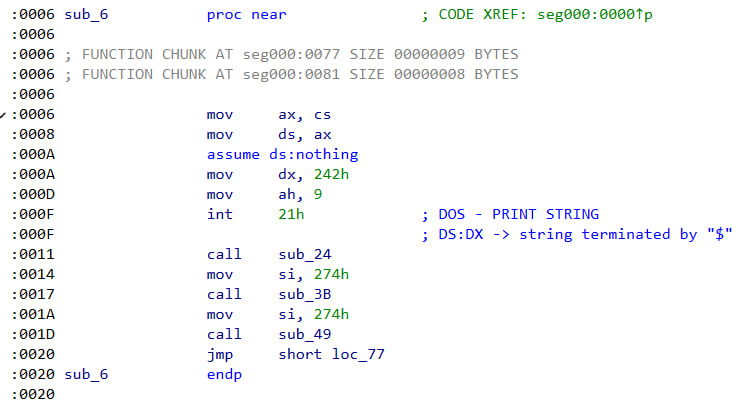
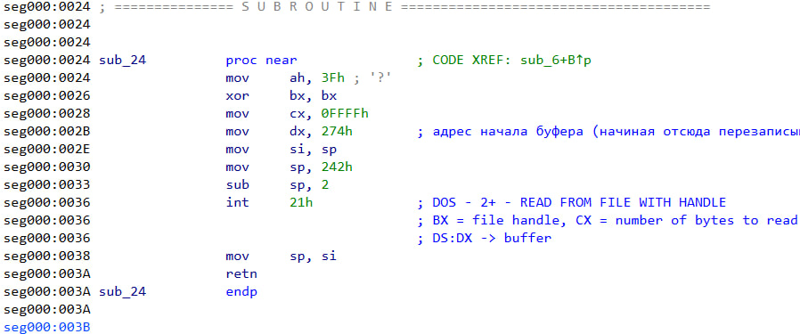
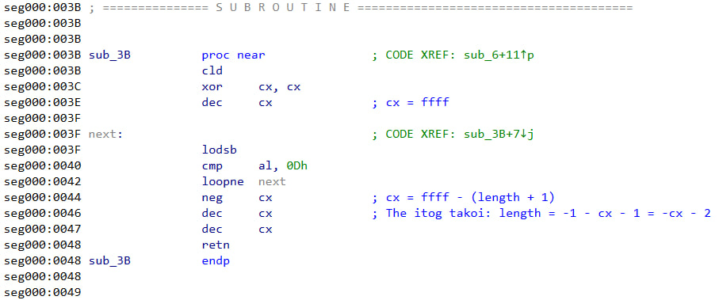
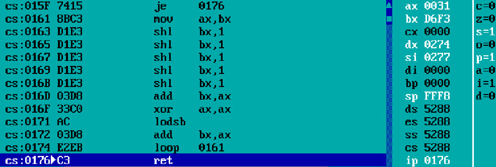
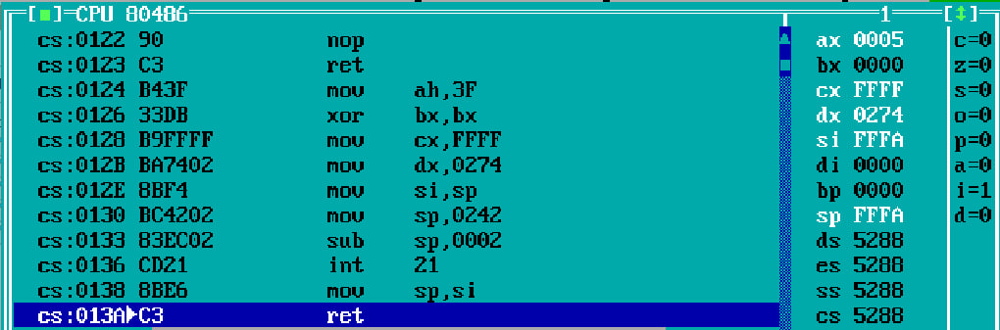
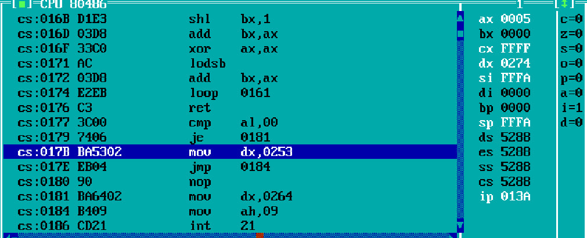

# Взлом

## Описание уязвимостей моей программы
Данная программа - crackme, демонстрирующий классическую уязвимость переполнения буфера в стеке в учебных целях.
Программа запрашивает пароль, сравнивает его с зашифрованным правильным ответом и выводит "Access granted!" или "Access denied." Но из-за отсутствия контроля длины ввода при копировании в локальный буфер возникает возможность перезаписать флаг успеха или адрес возврата функции и получить доступ при любом пароле.

Ожидается, что программа будет запущена в DOSBox

## Описание взлома программы друга
Основная цель этого проекта - взломать чужой исполняемый файл, не имея доступа к исходному файлу и не изменяя его.

### Тело задачи
Имеется программа, которая запрашивает у пользователя пароль. Если пользователь вводит правильный пароль, выводится "Access granted", иначе выводится "Access denied".

Мы знаем, что в программе должно быть 2 уязвимости, одна из которых простая и более заметная.

### Непосредственные шаги взлома

Чтобы найти уязвимости в чужом коде, необходимо использовать дизассемблер и отладчик. Таким образом, для взлома я использовал:
1. IDA Disassembler
2. Turbo Debugger

#### Анализ дизассемблера
- Используя IDA, начнем анализ имеющихся функций. В самом начале кода видим вызов функции `sub_6`, которая вызывает внутри себя несколько других функций. Сразу после вызова этой функции следует прыжок на метку с концом программы. Делаем вывод, что это функция является основной в программе (Main).



- Анализируя тело `sub_6`, замечаем, что эта функция сначала выводит приглашение на ввод пароля, а затем вызывает функцию `sub_24`, которая, используя функцию DOS'а под номером 3Fh обрабатывает ввод пользователя. Из этой функции мы можем извлечь полезную для взлома информацию:
1. В DX хранится адрес начала буфера (в нашем случае он равен _**274h**_)
2. В CX хранится количество байтов, которое нужно прочитать. Это число задано _**FFFFh**_, что на первый взгляд кажется чересчур большим. Запомним это.



- После выполнения функции `sub_24`, возвращаемся в функцию `sub_6`, которая теперь вызывает функцию `sub_3B`. Посмотрев тело этой функции поймем, что это стандартный способ подсчёта длины строки с одной важной особенностью: терминирующим символом является символ возврата каретки. Из этой функции мы можем извлечь полезную для взлома информацию: в CX на выходе из функции хранится длина строки, считающейся паролем, но не длина введённой строки!



- После выполнения функции `sub_3B`, возвращаемся в функцию `sub_6`, которая теперь вызывает функцию `sub_49`. В самом начале своего тела функция `sub_49` вызывает функцию `sub_58`. Заметим, что функция `sub_58` считает хэш строки, введённый пользователем, а функция `sub_49` сравнивает его с тем, который лежит по адресу cs:[374h]. Следовательно, по адресу cs:[374h] лежат 2 байта, принадлежащие правильному хэшу. Также обратим внимание, что после буфера и правильного хэша не лежит никакой программной информации. Если мы обратим внимание на то, что 374h находятся сразу после ячеек, зарезервированных под буфер, то мы поймем первую идею взлома: _**мы можем затереть правильный хэш своим**_. А также если мы вспомним, что программа читает FFFFh байтов, то мы поймем вторую идею взлома: _**мы можем затереть адрес возврата для функции ввода пароля и заменить его на адрес начала ветки случая, когда введён правильный пароль**_.

#### Анализ выполнения программы через отладчик для первой уязвимости
Реализуем первую идею взлома. Посмотрим, какой хэш считает программа для следующей строки "111CRLF"



Видим в регистре BX посчитанный хэш.

#### Непосредственный взлом первой уязвимости
Поле этого создадим текстовый файл, чтобы перенаправить ввод оттуда.
```txt
111[CR][LF]
0000....000[251 символ][символ с кодом F3][символ с кодом D6]
```

Запускаем программу, перенаправляем ввод из созданного файла и получаем заветную строку о том, что доступ
разрешён.

#### Анализ выполнения программы через отладчик для второй уязвимости
Реализуем вторую идею взлома. Посмотрим, куда указывает SP перед выходом из функции `sub_24`



Значит, по адресам FFFA и FFFB лежат байты адреса возврата.
Найдем нужный нам адрес, где начинается обработка ветки случая, когда введён правильный пароль.



Таким образом, нам нужно положить 7B по адресу FFFA и 01 по адресу FFFB. Теперь рассчитаем количество символов, которое нужно ввести, чтобы необходимые байты оказались вместо адреса возврата из функции. Вспомним, что буфер начинается с адреса 274h. Таким образом, нужно заполнить FFFAh - 0274h (64902 шт.) байтов нулями, а затем положить 7B и 01. Для этого напишем генератор:
```python
count = 0xFFFA - 0x0274 + 0          # 64902 байта нулей
with open('payload.txt', 'wb') as f:
    f.write(b'\x00' * count + b'\x7B\x01')
print('Файл создан')
```

Запускаем программу, перенаправляем ввод из созданного файла и получаем заветную строку о том, что доступ
разрешён.

## Итог
Данный проект учит пользоваться отладчиком и дизассемблером и показывает, насколько легко получить уязвимость в программе.


